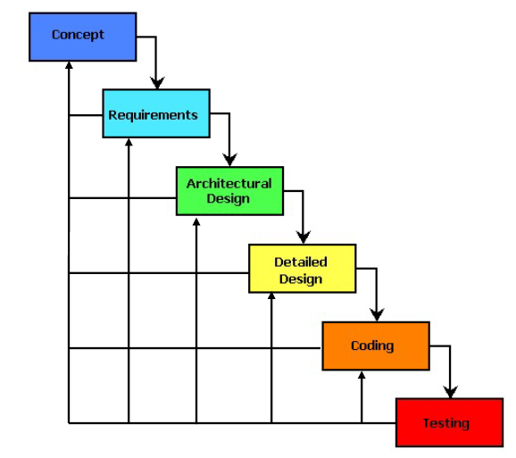
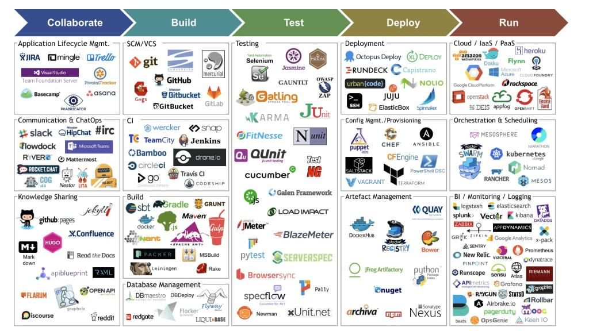
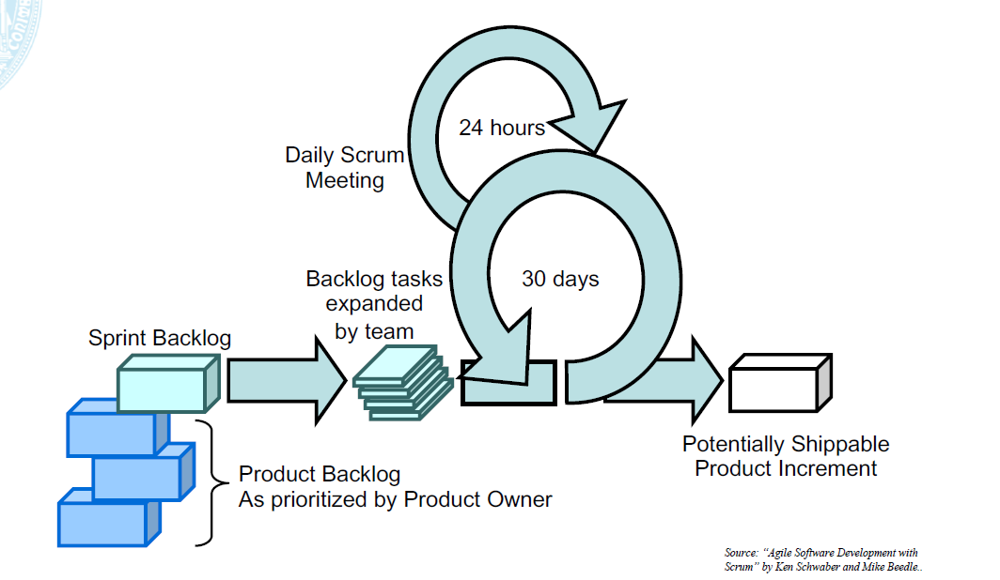
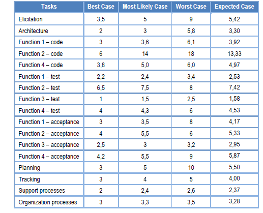
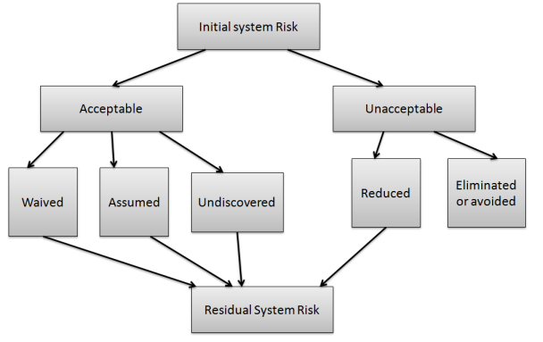
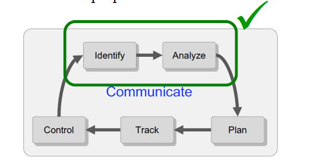

# Content

1. [Chapter 1: Introduction](#chapter1)
2. [Chapter 2: Base Concepts](#chapter2)
    - [Chapter 2 - Part 1: Systems and System Engineering](#chapter2part1)
    - [Chapter 2 - Part 2: Projects and Project Management](#chapter2part2)
    - [Chapter 2 - Part 3: Lifecycles](#chapter2part3)
    - [Chapter 2 - Part 4: Software Processes](#chapter2part4)
    - [Chapter 2 - Part 5: Agile Development](#chapter2part5)
3. [Chapter 3: Requirements Engineering](#chapter3)
    - [Chapter 3 - Part 1: What is a Requirement?](#chapter3part1)
    - [Chapter 3 - Part 2: What are Constraints?](#chapter3part2)
    - [Chapter 3 - Part 3: Who are the Stakeholders?](#chapter3part3)
    - [Chapter 3 - Part 4: What is the Scope?](#chapter3part4)
    - [Chapter 3 - Part 5: Types of Requirements](#chapter3part5)
    - [Chapter 3 - Part 6: What is Requirements Engineering?](#chapter3part6)
    - [Chapter 3 - Part 7: What is Requirements Management?](#chapter3part7)
    - [Chapter 3 - Part 8: Requirements Artifacts](#chapter3part8)
    - [Chapter 3 - Part 9: Key Problems in Elicitation](#chapter3part9)
    - [Chapter 3 - Part 10: Requirements Organization](#chapter3part10)
    - [Chapter 3 - Part 11: Requirements Prioritization](#chapter3part11)
    - [Chapter 3 - Part 12: Requirements Validation](#chapter3part12)
    - [Chapter 3 - Part 13: The Moving Requirements Target](#chapter3part13)
    - [Chapter 3 - Part 14: Assessing Requirements Volatility](#chapter3part14)
    - [Chapter 3 - Part 15: Dealing with Requirements Change](#chapter3part15)
    - [Chapter 3 - Part 16: Scope Creep](#chapter3part16)
4. [Chapter 4: Estimation](#chapter4)
    - [Chapter 4 - Part 1: What is Estimation?](#chapter4part1)
    - [Chapter 4 - Part 2: Why Estimate?](#chapter4part2)
    - [Chapter 4 - Part 3: Consequences of Bad Estimation?](#chapter4part3)
    - [Chapter 4 - Part 4: Why Are We Bad at Estimating?](#chapter4part4)
    - [Chapter 4 - Part 5: What Do We Need to Estimate?](#chapter4part5)
    - [Chapter 4 - Part 6: When to Estimate?](#chapter4part6)
    - [Chapter 4 - Part 7: Estimation Approaches](#chapter4part7)
    - [Chapter 4 - Part 8: WAG - Wild Altogether Guess](#chapter4part8)
    - [Chapter 4 - Part 9: Estimation by Analogy](#chapter4part9)
    - [Chapter 4 - Part 10: Experts Judgment](#chapter4part10)
    - [Chapter 4 - Part 11: Wideband Delphi](#chapter4part11)
    - [Chapter 4 - Part 12: Planning Poker](#chapter4part12)
    - [Chapter 4 - Part 13: Bottom-up Approach](#chapter4part13)
    - [Chapter 4 - Part 14: Bottom-up Steps](#chapter4part14)
    - [Chapter 4 - Part 15: Create Project WBS](#chapter4part15)
    - [Chapter 4 - Part 16: Three-point Estimate and Estimate Each Task](#chapter4part16)
    - [Chapter 4 - Part 17: Calculate Overall Estimate](#chapter4part17)
    - [Chapter 4 - Part 18: Bottom-up PBS Steps](#chapter4part18)
    - [Chapter 4 - Part 19: Product-based Decomposition](#chapter4part19)
    - [Chapter 4 - Part 20: Function Points](#chapter4part20)
    - [Chapter 4 - Part 21: COCOMO](#chapter4part21)
    - [Chapter 4 - Part 22: Use Case Points](#chapter4part22)
5. [Chapter 5: Risk Management](#chapter5)
    - [Chapter 5 - Part 1: What is Risk?](#chapter5part1)
    - [Chapter 5 - Part 2: Risk Management](#chapter5part2)
    - [Chapter 5 - Part 3: Four Ways to Handle Risk](#chapter5part3)
    - [Chapter 5 - Part 4: Continuous Risk Management Cycle](#chapter5part4)
    - [Chapter 5 - Part 5: Small Team Risk Assessment](#chapter5part5)
    - [Chapter 5 - Part 6: Small Team Risk Assessment Process](#chapter5part6)
    - [Chapter 5 - Part 7: Threshold of Success (ToS)](#chapter5part7)
    - [Chapter 5 - Part 8: Review of Goals](#chapter5part8)
    - [Chapter 5 - Part 9: Identification of Risk Statemants](#chapter5part9)
    - [Chapter 5 - Part 10: Define Attributes](#chapter5part10)
    - [Chapter 5 - Part 11: Evaluation](#chapter5part11)
    - [Chapter 5 - Part 12: Prioritization](#chapter5part12)
    - [Chapter 5 - Part 13: Risk Mitigation](#chapter5part13)
6. [Chapter 6: Planning & Tracking](#chapter6)
    - [Chapter 6 - Part 1: Software Project Planning](#chapter6part1)
    - [Chapter 6 - Part 2: Steps in Project Planning](#chapter6part2)
    - [Chapter 6 - Part 3: Scheduling](#chapter6part3)
    - [Chapter 6 - Part 4: Why are Projects Late?](#chapter6part4)
    - [Chapter 6 - Part 5: Tools and Techniques](#chapter6part5)
    - [Chapter 6 - Part 6: Planning Techniques: Work Breakdown Structure (WBS)](#chapter6part6)
    - [Chapter 6 - Part 7: Planning Techniques: Program Evaluation and Review Technique (PERT)](#chapter6part7)
    - [Chapter 6 - Part 8: Planning Techniques: Gantt Chart](#chapter6part8)
    - [Chapter 6 - Part 9: Tracking: Earned Value Management (EVM)](#chapter6part9)
    - [Chapter 6 - Part 10: Tracking: Burndown Charts](#chapter6part10)
7. [Bibliography's](#biblio)

## Chapter 1: Introduction

Project management is a fundamental topic, and needed in all domains of informatics, computer science, and others. Despite of the role you play, you need to know about project management.

In the Project management, budget and time are finite resources, sp, requirements, scope, and quality have to be managed.

**Topics**

- Base Concepts
    - Systems Engineering
    - Projects and Project Management
    - Lifecycles and Engineering processes
- Scope and Requirements Management
    - Scope Definition
    - Requirements Management
    - Change Control
- Planning and Tracking
    - Estimation
    - Risk Management
    - Planning and Tracking
- Managing Customer Expectations
    - Decision Making
    - Perception, satisfaction and Expectations
    - Communication
    - Negotiation
- Managing Teams and People
    - Conflict Management
    - Relationship Management
    - Leadership

## Chapter 2: Base Concepts

#### Chapter 2 - Part 1: Systems and System Engineering

**What is a System?** 

Definition: A system is a group of interacting or interrelated elements that act according to a set of rules to form a unified whole.

System is surrounded and influenced by the environment, described by its boundaries and structure, purpose expressed in its functioning and subject to emergent behaviors!

**What is System Engineering?** 

Definition: System engineering is a robust approach to the design, creation, and operation of systems. In simple terms, the approach consists of identification and quantification of system goals, creation of alternative system design concepts, performance of design trades, selection and implementation of the best design, verification that the design is properly built and integrated, and post-implementation assessment of how well the system meets (or met) the goals”

System Engineering is interdisciplinary field of engineering, focuses on how to design and manage complex systems over their lifecycles.

Systems engineering deals with:
 - Work-processes
 - Optimization methods
 - Risk management

#### Chapter 2 - Part 2: Projects and Project Management

**What is a Project?** 

A project is defined as a sequence of tasks that must be completed to attain a certain outcome. According to the Project Management Institute (PMI), the term Project refers to to any temporary endeavor with a definite beginning and end”. Depending on its complexity, it can be managed by a single person or hundreds.

A project is a set of interdependent tasks that have a common goal. Projects have the following characteristics:

- Collaborative enterprise
  - Temporary (not permanent)
  - Constituted by teams within or across organizations
- Involves research and/or design
- Carefully planned to achieve a particular aim
- **Goal:*** to accomplish particular tasks under time constraints

**What is Project Management?** 

Definition: Planning, organizing, motivating, and controlling resources, procedures and protocols to achieve specific goals in scientific or daily problems.

The challenge is to achieve the project goals and objectives while honoring the preconceived constraints!

Disciplines Involved:
 - Scope management
 - Requirements management
 - Planning and tracking
 - Acquisition and contracting
 - Clients management
 - Team management
 - Quality management

**Disciplines Involved:**
 - Scope
 - Time
 - Resources
 - Quality

#### Chapter 2 - Part 3: Lifecycles

**What is a Lifecycle?** 

Definition: The series of stages in form and functional activity through which an organism passes between successive recurrences of a specified primary stage

- Generalize the development process into steps with associated activities and artifacts
  - Model how a project is planned, controlled, and monitored from inception to completion
  
- Lifecycle models provide a starting point for defining what we will do and not HOW we will do it

- Select the right Lifecycle based in the magic four (Scope, Time, Resources and Quality). How do I tailor the project to fit the SDLC we typically use? Tailor the SDLC to your project not the reverse

Some Lifecycles
- Ad Hoc
- Classic (Waterfall)
- Incremental
- Spiral
- Prototype
- V model
- Chaos

**Ad Hoc**

Do-Test-Do-Test....

Creating software without any formal guidelines or process

Some disadvantages of ad-hoc development: 
 - some important actions (testing, design) may go ignored
 - not clear when to start or stop doing each task
 - does not scale well to multiple people
 - not easy to review or evaluate one's work

 

 Fig 1 - Ad Hoc - (<a href='https://www.uc.pt/en/fctuc/dei'>Work by University of Coimbra - DEI - https://www.uc.pt/en/fctuc/dei </a>) 

 

**Waterfall Model**

The waterfall model is a classical model used in system development life cycle to create a system with a linear and sequential approach. It is termed as waterfall because the model develops systematically from one phase to another in a downward fashion.

 

 Fig 2 - Waterfall - (<a href='https://www.uc.pt/en/fctuc/dei'>Work by University of Coimbra - DEI - https://www.uc.pt/en/fctuc/dei </a>) 

 

Successful in the Pass:

 - Technological reasons
   - Slow code, compile, and debug cycles
 - Social reasons
   - Reflected the way that other engineering disciplines build things
 - Appeared when software development was chaotic
   - Rules were welcomed
 - Well defined stages help with
   - Planning, scheduling, management, organization, accountability, control

A Lot of Problems:

 - Very fast changes over time
   - Requirements, Market, Team members
 - Some disadvantages
   - Client sees nothing until the end
   - No feedback
   - Cascading Bugs
   - Can't chage the requirements
 - When something goes wrong, go back

 

 Fig 3 - Waterfall Go Back - (<a href='https://www.uc.pt/en/fctuc/dei'>Work by University of Coimbra - DEI - https://www.uc.pt/en/fctuc/dei </a>) 

 

**Waterfall With Stage Delivery**

 

 Fig 4 - Waterfall With Stage Delivery - (<a href='https://www.uc.pt/en/fctuc/dei'>Work by University of Coimbra - DEI - https://www.uc.pt/en/fctuc/dei </a>) 

 

**Incremental Model**

Incremental Model is a process of software development where requirements are broken down into multiple standalone modules of software development cycle. Incremental development is done in steps from analysis design, implementation, testing/verification, maintenance.

- Developing and delivering the product in planned increments
  - The product is designed to be delivered in increments
  - Each increments provides (in theory) more functionality than the previous increment

 

 Fig 5 - Incremental Model - (<a href='https://www.uc.pt/en/fctuc/dei'>Work by University of Coimbra - DEI - https://www.uc.pt/en/fctuc/dei </a>) 

 

**Spiral Model**

The spiral model combines the idea of iterative development with the systematic, controlled aspects of the waterfall model. This Spiral model is a combination of iterative development process model and sequential linear development model i.e. the waterfall model with a very high emphasis on risk analysis. It allows incremental releases of the product or incremental refinement through each iteration around the spiral.

The term spiral refers to successive iterations outward from a central starting point

The goal is to Identify risk and Focus on it early

Risk is reduced in outer spirals as the product becomes more refined

Each spiral Starts with design goals and Ends with the client reviewing the progress this far and future direction

Adequate for long term projects: Was originally prescribed to last up to 2 years!

 

 Fig 6 - Spiral Model - (<a href='https://www.uc.pt/en/fctuc/dei'>Work by University of Coimbra - DEI - https://www.uc.pt/en/fctuc/dei </a>) 

 

**DevOps**

The term DevOps is a combination of two words namely Development and Operations. DevOps is a practice that allows a single team to manage the entire application development life cycle, that is, development, testing, deployment, operations.

The aim of DevOps is to shorten the system’s development life cycle while delivering features, fixes, and updates frequently in close alignment with business objectives.

DevOps is a software development approach through which superior quality software can be developed quickly and with more reliability. It consists of various stages such as continuous development, continuous integration, continuous testing, continuous deployment, and continuous monitoring.

Set of practices combining SW development and IT operations
 - Shorten the systems development life cycle
 - Provide continuous delivery with high software quality

Tool Chain
 - Coding: code dev and review, source code management, code merging
 - Building: continuous integration tools, build status
 - Testing: continuous testing tools that provide quick and timely feedback
 - Packaging: artifact repository, application pre-deployment staging
 - Releasing: change management, release approvals, release automation
 - Configuring: infrastructure conf and management, infrastructure as code
 - Monitoring: performance monitoring, end-user experience

 

 Fig 7 - DevOps - (<a href='https://www.edureka.co/blog/devops-lifecycle/'>Work by Arvind </a>) 

 

 Fig 8 - DevOps - (<a href='https://www.reddit.com/r/devopsGuru/comments/e46bgx/life_cycle_devops_mesh/'>Work by jackjosh </a>) 

 

 Fig 9 - DevOps - (<a href='https://devopedia.org/devops'>Work by tintin and arvindpdmn </a>) 

 

#### Chapter 2 - Part 4: Software Processes

**What is a Process?** 

Definition: A series of actions or operations conducing to an end

Software process:
  - Sequence of steps performed for a given purpose
  - Specific steps used in a specific organization to build systems
  - Specific activities that must be undertaken and artifacts that must be produced
  - Include more detail than provided lifecycle models

     Software Process ≠ Life cycle Model

Software process may be defined in the context of a lifecycle model

The only source of defects in software are humans

- Processes are needed to
  - Control the human variable
  - Identify problem sources
  - Make the outcomes repeatable

 

 Fig 10 - Software Process Spectrum - (<a href='https://www.uc.pt/en/fctuc/dei'>Work by University of Coimbra - DEI - https://www.uc.pt/en/fctuc/dei </a>) 

 

#### Chapter 2 - Part 5: Agile Development

**What is Agile?**

Agile is an iterative approach to project management and software development that helps teams deliver value to their customers faster and with fewer headaches. Instead of betting everything on a "big bang" launch, an agile team delivers work in small, but consumable, increments. Requirements, plans, and results are evaluated continuously so teams have a natural mechanism for responding to change quickly.

Definition: Marked by ready ability to move with quick easy grace

- As applied to Software Development: Ability to change development in response to changing requirements

- What agile proponents say
  - High flexibility
    - Market changes
    - Technology changes
    - Unclear requirements
  - More coding, less paper-work
  - Higher quality, quicker

Some Agile Processes
- XP
- Scrum
- Crystal
- Feature Driven
- RUP
- Dynamic Systems Develop Method
- Adaptive Software Develop
- Synch and stabilize

Choosing a Process is a big problem, do not tailor your project to a process instead tailor the right process. Use some in tailoring

But, defining Processes sometimes it is necessary. 
Be sure that you know: Why you are developing a process and what are the goals of the process. Ensure that processes are in-line with business goals. Involve stakeholders, and They should develop the process. Be sure that the process is appropriate for organization/program/project

 

 Fig 11 - Scrum - (<a href='https://www.uc.pt/en/fctuc/dei'>Work by University of Coimbra - DEI - https://www.uc.pt/en/fctuc/dei </a>) 

 

## Chapter 3: Requirements Engineering

A Video of [Project Management Fail][pmfail-url]

#### Chapter 3 - Part 1: What is a Requirement?

- “Requirements form a set of statements that describe the users needs and desires” -- T & K

- “A detailed description of what the system is supposed to do” -- McConnell

Requirement is a condition or capability possessed by the software or system component in order to solve a real world problem. The problems can be to automate a part of a system, to correct shortcomings of an existing system, to control a device, and so on. IEEE defines requirement as (1) A condition or capability needed by a user to solve a problem or achieve an objective. (2) A condition or capability that must be met or possessed by a system or system component to satisfy a contract, standard, specification, or other formally imposed documents. (3) A documented representation of a condition or capability as in (1) or (2).’

Requirements describe how a system should act, appear or perform. For this, when users request for software, they provide an approximation of what the new system should be capable of doing. Requirements differ from one user to another and from one business process to another.

[Source][requirements-url]

#### Chapter 3 - Part 2: What are Constraints?

- Limits imposed on the system due to users, customers, developers, technology, laws and standards -- Davis

To minimise constraints, then, it’s first helpful to understand their definition.

A constraint is anything that slows a system down or prevents it from achieving its goal. You could think of a constraint as a bottleneck in your processes that impedes your progress. There are many, many different types of constraint.

However, it’s important to note that a system cannot have hundreds or thousands of constraints at one time. The maximum is capped. This is because constraints are the factors that most limit your software production.

**Sources of Constraints**

- **Policy**
  Policy constraints are those caused by your company procedures and policies. They include regulations and ‘red tape’ that you must navigate. In software development, a policy constraint could relate to security / compliance requirements. Or, it could be an issue with handing off code between team members, for instance. 

  Policy constraints are the most common form of constraint in any industry.

- **Equipment**
  Equipment constraints are those delays caused by faulty, slow, or out of date equipment or a lack of sufficient space. In software development, this could be faulty keyboards or slow computers. Or, it might be a lack of devices through which to run cross-platform tests – i.e. no Mac, no access to an iPad, etc. It might even be the lack of a quiet office space to code in.

- **People**
  A people constraint is a bottleneck caused by the number of people on a project. Often, it’s thought that people constraints are caused by not having enough skill for a project. While this can be the case, in software development, having too many skilled people on a project can also cause a people constraint. (Known as and explained by Brooks’ law.)

- **Paradigm**
  A paradigm constraint is a constraint caused by beliefs. For example, the belief that ‘lines of code’ is a good metric for productivity, when the opposite can often be true.

- **Market**
  A market constraint is where the constraint lies in delivering your software to consumers. That is, you’re creating more than is needed. In software, this would look like overengineering and feature creep. You’re spending time creating things that consumers don’t want or need.
  
  [Source][constraints-url]

#### Chapter 3 - Part 3: Who are the Stakeholders?

- Anyone who benefits in a direct or indirect way from the system which is being developed -- Sommerville

In simple words, anyone having any type of relation/interest in the project is known as stakeholder. The term Software Project Stakeholder refers to, “a person, group or company that is directly or indirectly involved in the project and who may affect or get affected by the outcome of the project”.

[Source][stakeholder-url]

#### Chapter 3 - Part 4: What is the Scope?

- “The work that needs to be accomplished to deliver a product, service, or result with the specified features and functions” -- PMBOK

- “The features and functions that characterize a product, service, or result” -- PMBOK

- What is in and what is out!

- Must be negotiated, controlled and managed

- Specified in the Statement of Work (SoW)

Software scope is a well-defined boundary, which encompasses all the activities that are done to develop and deliver the software product.

The software scope clearly defines all functionalities and artifacts to be delivered as a part of the software. The scope identifies what the product will do and what it will not do, what the end product will contain and what it will not contain.

[Source][scope-url]

#### Chapter 3 - Part 5: Types of Requirements

- **Functional (what)**: 
  - These are the requirements that the end user specifically demands as basic facilities that the system should offer. All these functionalities need to be necessarily incorporated into the system as a part of the contract. These are represented or stated in the form of input to be given to the system, the operation performed and the output expected. They are basically the requirements stated by the user which one can see directly in the final product, unlike the non-functional requirements.
  - For example, in a hospital management system, a doctor should be able to retrieve the information of his patients. Each high-level functional requirement may involve several interactions or dialogues between the system and the outside world. In order to accurately describe the functional requirements, all scenarios must be enumerated.
  - There are many ways of expressing functional requirements e.g., natural language, a structured or formatted language with no rigorous syntax and formal specification language with proper syntax.

- **Non-functional – aka Quality Attributes**
  - Non-functional requirements: These are basically the quality constraints that the system must satisfy according to the project contract. The priority or extent to which these factors are implemented varies from one project to other. They are also called non-behavioral requirements.
They basically deal with issues like:
    - Portability
    - Security
    - Maintainability
    - Reliability
    - Scalability
    - Performance
    - Reusability
    - Flexibility
  
  - NFR’s are classified into following types:
    - Interface constraints
    - Performance constraints: response time, security, storage space, etc.
    - Operating constraints
    - Life cycle constraints: mantainability, portability, etc.
    - Economic constraints
  
  
- **Domain requirements:**
  - Domain requirements are the requirements which are characteristic of a particular category or domain of projects. The basic functions that a system of a specific domain must necessarily exhibit come under this category. For instance, in an academic software that maintains records of a school or college, the functionality of being able to access the list of faculty and list of students of each grade is a domain requirement. These requirements are therefore identified from that domain model and are not user specific.

[Source][typerequirement-url]

#### Chapter 3 - Part 6: What is Requirements Engineering?

- Systematic way of getting from need to specification
  - Must be planned

- Elicit need

- Analyze
  - Validate and quantify
    - Functional
    - Quality attributes
    - Constraints
   - Set completion criteria
   - Establish working agreement (SoW)

 - Document

**From T & K**
- Elicitation
- Definition, categorizing and documentation
- Specification
- Prototyping
- Analysis
- Review and Validation
- Agreement and acceptance

**From Pressman**
- Gathering
- Modeling
- Management
- Validation

Requirement Engineering is the process of defining, documenting and maintaining the requirements. It is a process of gathering and defining service provided by the system. Requirements Engineering Process consists of the following main activities:

- Requirements elicitation
- Requirements specification
- Requirements verification and validation
- Requirements management

- **Requirements Elicitation:** It is related to the various ways used to gain knowledge about the project domain and requirements. The various sources of domain knowledge include customers, business manuals, the existing software of same type, standards and other stakeholders of the project.
The techniques used for requirements elicitation include interviews, brainstorming, task analysis, Delphi technique, prototyping, etc. Elicitation does not produce formal models of the requirements understood. Instead, it widens the domain knowledge of the analyst and thus helps in providing input to the next stage.

- **Requirements specification:** This activity is used to produce formal software requirement models. All the requirements including the functional as well as the non-functional requirements and the constraints are specified by these models in totality. During specification, more knowledge about the problem may be required which can again trigger the elicitation process.
The models used at this stage include ER diagrams, data flow diagrams(DFDs), function decomposition diagrams(FDDs), data dictionaries, etc.

- **Requirements verification and validation:**
  - **Verification:** It refers to the set of tasks that ensures that the software correctly implements a specific function.
  - **Validation:** It refers to a different set of tasks that ensures that the software that has been built is traceable to customer requirements.
If requirements are not validated, errors in the requirement definitions would propagate to the successive stages resulting in a lot of modification and rework.
The main steps for this process include:

- The requirements should be consistent with all the other requirements i.e no two requirements should conflict with each other.
- The requirements should be complete in every sense.
- The requirements should be practically achievable.

Reviews, buddy checks, making test cases, etc. are some of the methods used for this.

- **Requirements management:** Requirement management is the process of analyzing, documenting, tracking, prioritizing and agreeing on the requirement and controlling the communication to relevant stakeholders. This stage takes care of the changing nature of requirements. It should be ensured that the SRS is as modifiable as possible so as to incorporate changes in requirements specified by the end users at later stages too. Being able to modify the software as per requirements in a systematic and controlled manner is an extremely important part of the requirements engineering process.

[Source][requirementengineering-url]

#### Chapter 3 - Part 7: What is Requirements Management?

- “The purpose of Requirements Management (REQM) is to manage requirements of the project’s products and product components and to ensure alignment between those requirements and the project’s plans and work products” -- CMMI Level

- Manage Requirements:
  - Understand requirements
  - Obtain commitment to requirements
  - Manage requirements changes
  - Maintain bidirectional traceability of requirements
  - Ensure alignment between project work and requirements

Requirements management can be defined as a process of eliciting, documenting, organizing, and controlling changes to the requirements. Generally, the process of requirements management begins as soon as the requirements document is available, but ‘planning’ for managing the changing requirements should start during the requirements elicitation process.

Requirements management enables the development team to identify, control, and track requirements and changes that occur as the software development process progresses. Other advantages associated with the requirements management are listed below:

- **Better control of complex projects:** This provides the development team with a clear understanding of what, when, and why the software is to be delivered. The resources are allocated according to user-driven priorities and relative implementation effort.

- **Improved software quality:** This ensures that the software performs according to the requirements to enhance software quality. This can be achieved when the developers and testers have a precise understanding of what to develop and test.

- **Reduced project costs and delays:** This minimizes errors early in the development cycle as it is expensive to ‘fix’ errors at the later stages of the development cycle. As a result, the project costs also reduce.

- **Improved team communication:** This facilitates early involvement of users to ensure that their needs are achieved.

- **Easing compliance with standards and regulations:** This ensures that standards involved with software compliance and process improvement have a thorough understanding of requirements management. For example, CMM addresses requirements management as one of the first steps to improve software quality.

[Source][requirementmanagement-url]

#### Chapter 3 - Part 8: Requirements Artifacts

- Requirements engineering can create a number of different artifacts

Whether you’re an amateur or professional developer, you’re going to be dealing with software artifacts. They’re some of the most crucial parts of any piece of software, from a website to a more complex program.

Without properly created and stored artifacts, the software development process is going to be much more of a slog than it needs to be.

**What Is an Artifact?**

To put it simply, an artifact is a by-product of software development. It’s anything that is created so a piece of software can be developed. This might include things like data models, diagrams, setup scripts — the list goes on.

Typically, a software development team will come up with a list of necessary artifacts for a piece of software before coding anything. These include things like risk assessments, source code, diagrams, and use cases. This is done during the research phase of the project.

Developing a piece of software without any of this is like building a house without blueprints. The process would be a huge mess, and crucial pieces would inevitably be left out. In this way, getting all your artifacts together is one of the most crucial parts of the software development life cycle.

Examples:
    - Statement of Work (SoW)
    - Requirement specification (SRS)
    - Concept of operation
    - Initial project plans
    - Acceptance criteria
    - Use Cases
    - Unified Modeling Language (UML)
    - Class Diagrams
    - Images
    - Software Documents
    - Source Code
    - Meeting Notes
    - Risk Assessments
    - Prototypes
 
 **The Compiled Application**

Once the piece of software is fully developed, it’s compiled into a usable application. This is the final artifact, and one of the only ones a typical user will care about. The compiled application will let the user install it onto their machine, and use it as its meant to be used.

There may be a number of these in the artifact repository. There could be different versions, from early prototypes to experimental builds and the final compilation.

[Source][artifact-url]

**Statement of Work (SOW)**

- Assigns responsibilities to the various stakeholders

- Who builds what, and when

- Who tests what, how, and when

- Who pays for what, and when

- Who reports to whom

- Who accepts/approves completion

- Who, how, and when changes are authorized

**Requirement Specification (SRS)**

- Created as a consequence of requirements analysis

- Context
  - Identify what is internal and external to the system

- Functions the system must perform

- Constraints
  - Technical, cost, and schedule

- Quality attributes

- Prioritization

#### Chapter 3 - Part 9: Key Problems in Elicitation

- **Inarticulateness**
  - Many stakeholders (especially users) cannot explain what they do or need
  - Sometimes they do not know what they want!
  - Quality attributes are the most difficult for stakeholders to articulate

- **Domain lingo**
  - Stakeholders have a different vocabulary from that of designers and developers

- **Hidden assumptions**
  - The “stuff” everybody knows often goes unstated
  - No matter how obvious, critical assumptions must be explicitly stated and recorded

- **Preconceived solutions**
  - Some stakeholders think they know the answers to their problems
  - Sometimes they do, but these answers may not be the best

- **Lack of common experience**
  - You do not know your customer’s domain and they do not know yours
  - They will:
    - Remember the exception and forget the routine, underemphasize the simple stuff, focus on what does not work and not on what does work, …
  - Designers and developers will:
    - Ask naïve questions about the requirements and the stakeholders’ domain, constantly make assumptions, attempt to communicate in technical terms, …

#### Chapter 3 - Part 10: Requirements Organization

- After gathering requirements, the next step is to **document and organize** them

- **Affinity Groups** – collections of related things
  - Items conceptually related
  - Items related by theme (function, feature, etc.)

- **Hierarchies** – ordered dependencies
  - Lower items subordinate to higher items
  - Lower items elaborate or further explain higher items

- **Organization Steps**
  - Requirements should be organized in three steps:
    1. Divide requirements into affinity groups
    2. Structure each group hierarchically
    3. Identify gaps

  - Gaps and inconsistencies may require **further analysis and/or elicitation**

**1. Divide requirements into affinity groups**

  - Scan the set of needs or ideas
    - Yellow stickies work well
  
  - Identify independent themes
    - Each theme defines a group

  - Give each group a prose description
    - Explain high level need
    - Explain specific requirements

**2. Structure each group hierarchically**

  - Organize each group hierarchically
    - Priority
    - Higher/lower levels of abstraction
    - Identify constraints

  - Work towards a **tree structure** - [Example][treestructure-url]

  - Add new information if necessary

**3. Identify gaps**

  - Gaps are places where the **requirements are incomplete**
  
  - Examples:
    - Ungrouped (or un-groupable) ideas
    - Lots of miscellaneous groups
    - Lots of "and so on" or "etc." phrases
    - Inconsistent or unclear terminology
    - Lots of derived requirements

#### Chapter 3 - Part 11: Requirements Prioritization

- Some requirements are more important than others:
  - Some functionality is urgently needed
  - Some quality attributes are essential
  - Some requirements are hard to achieve

- **Prioritization in the specification is essential** for:
  - Setting expectations
  - Reasoning about technical tradeoffs
  - Planning the work

- Prioritization provides guidance to designers regarding:
  - Importance
  - Urgency
  - Implementation dependencies
  - Difficulty
  - Availability of resources

- There are a variety of strategies for prioritization
  - **Stakeholders must be involved** in the prioritization!

- Less granularity, the easier it is
  - 1 to N priority
  - “High, medium, low”
  - “Must have, nice to have, wishful thinking”
  - The MoSCoW method
    - Must have, Should have, Could have, Won't have (this time)

- From XP
  - Customer sets initial priority groups
  - Developers set priority within groups

- From Scrum
  - Prioritization is done by the Product Owner when he or she prioritizes User Stories in the Prioritized Product Backlog. The Prioritized Product Backlog contains a list of all the requirements needed to bring the project to fruition.
  - Prioritization results in deliverables that satisfies the requirements of the customer with the objective of delivering the maximum business value in the least amount of time. 

[Source][scrumpriorization-url]

#### Chapter 3 - Part 12: Requirements Validation

- Examine the requirements specification to look for and fix:
  - Ambiguity
  - Inconsistencies, omissions and errors
  - Conformance to standards
    - Products
    - Processes

- Typically done at **formal review**

**Checklist – For Each Requirement:**

- Stated clearly
- Source identified
- Original source concurs with spec
- Measurable
- Cross referenced
- Does not violate domain constraints
- Testable
- Traceable to a system model
- Traceable to overall system / product objectives
- Spec. is understandable
- Indexed
- Association with non-functional

#### Chapter 3 - Part 13: Managing Change and Evolution

 

 Fig 12 - The Moving Requirements Target - (<a href='https://www.uc.pt/en/fctuc/dei'>Work by University of Coimbra - DEI - https://www.uc.pt/en/fctuc/dei </a>) 

 

- Never fool yourself into thinking that you can freeze requirements
  - They will change anyway!
  - The best you can do is take a snapshot of the current need, anticipate, and manage changes to requirements

- “Things alter for the worse spontaneously, if they be not altered for the better designedly” -- Francis Bacon (1561-1626), Renaissance author, courtier, and father of deductive reasoning

- Change is different of Evolution
  - Change is violent and abrupt
  - Evolution is gradual and, if planned for, goes unnoticed

- Once you accept that requirements will evolve and change, you can begin to analyze how volatile they really are

- Managers must ask three tough questions:
  - How do we identify and quantify volatility?
  - How do we respond to change and evolution?
  - How do we deal with unreasonable changes?

- The answers to these questions will form the basis of your requirements change and evolution strategy!

#### Chapter 3 - Part 14: Assessing Requirements Volatility

- Most managers deal with evolution and change in a passive-reactive way

- In most cases this is not appropriate
  - Reluctance to fund designs that support anticipated volatility
  - Evolutionary becomes disruptive change

- Change should be anticipated!

**Sources of Requirements Volatility**

- To assess these sources of volatility, we need to consider:
  - The organizational environments
    - Structure
    - Policies
    - Business/mission
  - Stakeholders
    - Personnel turnover
    - New communities
  - Technological trends

- This will involve **further elicitation with stakeholders**
  - And they may not care!

**Responses to Volatility**

- There are two extremes:
  - “Sorry, no can do. The requirements are frozen.”
  - “OK. The customer is always right.”

- Neither position is tenable
  - Offer new features and qualities in subsequent versions
  - Be prepared to describe the cost and impact of changes

- **Evaluate the source of volatility!**

[Source][requirementvolatility-url]

#### Chapter 3 - Part 15: Dealing with Requirements Change

- Have established baseline! (v1.0)
  - Scheduled “no more good ideas” date

- Collect the Changes
  - Source
  - Classification
  - Dates – collected, reviewed, action

- Analyze impact
  - Traceability Table
  - Schedule / cost / resources / scope / etc.

- **Renegotiate as needed**

- Dealing with Requirements Change: **How is it Done in SCRUM?**
  - In Scrum, all requirements related to an ongoing Sprint are frozen during the Sprint. No change is introduced until the Sprint ends, unless a change is deemed to be significant enough to stop the Sprint. In the case of an urgent change, the Sprint is terminated and the team meets to plan a new Sprint. This is how Scrum accepts changes without creating the problem of changing release dates.

[Source][scrumpriorization-url]

#### Chapter 3 - Part 16: Scope Creep

- Changes, continuous or uncontrolled growth in a project’s scope
  - Can happen at any point after the project begins!

- Occurs when the scope of a project is not properly defined, documented, or controlled

- Related to but distinct from feature creep
  - Feature creep refers to features and scope creep refers to the whole project

- Can be a result of:
  - Poor change control
  - Lack of proper initial identification of what is required
  - Weak project manager or sponsor
  - Poor communication between stakeholders

[The Wasa - A True Story of Scope Creep][wasa-url]

[Scope Creep - Project Management][scopecreepvideo-url]

## Chapter 4: Estimation

#### Chapter 4 - Part 1: What is Estimation?

- For us: 
  - How much efforty we need to do something.

- The American Heritage Dic., 2nd College Edition, 1985:
  - A tentative evaluation or rough calculation
  - A preliminary calculation of the cost of a project
  - A judgment based upon one’s impressions; an opinion

**An estimate is a prediction of how long a project will take or how much it will cost**

Estimation is the process of finding an estimate, or approximation, which is a value that can be used for some purpose even if input data may be incomplete, uncertain, or unstable.

[Source][estimation-url]

#### Chapter 4 - Part 2: Why Estimate?

- Only 35% of the projects can be considered successful
- 46% of the projects are considered “challenged”
- 19% of project never complete

#### Chapter 4 - Part 3: Consequences of Bad Estimation?

- Economic
  - Loss of contracts
  - Company crash

- Technical
  - Low quality work

- Managerial
  - Low motivation
  - Personnel loss

- Lose money and prestige!!!

#### Chapter 4 - Part 4: Why Are We Bad at Estimating?

- Systems complexity
  - Infrequency
  - Underestimation bias
  - Complexity vs size

- Very fast changes over time
  - Requirements, market, people, etc.

- Unrealistic goals
  - Must be done by June!

- The Problem of estimations is **Assumptions**

“It is very difficult to make a vigorous, plausible, and job-risking defense of an estimate that is derived by no quantitative method, supported by little data, and certified chiefly by the hunches of the managers” -- Fred Brooks

#### Chapter 4 - Part 5: What Do We Need to Estimate?

- Size

- Effort

- Cost

**Let’s Make an Exercise: How much time does it take to get to Lisbon by car?**

Depends the model of the car, the road you will take, the velocity, the driver and another factors.

 

 Fig 13 - Estimation Variability - (<a href='https://www.uc.pt/en/fctuc/dei'>Work by University of Coimbra - DEI - https://www.uc.pt/en/fctuc/dei </a>) 

 

With more time in project, we will have more precise of the estimation (Effort, Cost and Features), In the begin of the project, we don't have much estimation.

#### Chapter 4 - Part 6: When to Estimate?

- During the bid
  - Short duration
  - As fast as possible
  - Reduced knowledge about the problem

- At project start
  - Create a project plan
  - Allocate resources
  - Detailed estimation

- During the project
  - Handle change

- **Estimate in the Bid**

  - No “real” money evolved
    - But it costs money: cost of losing the bid; cost of performing the estimation!!!
 
  - Key issue:
    - Compare with available history on other projects

  - Must be performed as quickly and cheaply as possible
    - Market do not wait for you
    - You are investing in something you are not sure to win

  - How important is it?
    - Critical!!!
    - Decisive to win the bid
    - It defines the money you will have to run the project

- **Decisive During Bid**

  - Identify critical requirements
    - The ones that really determine the development effort
    - Pareto rule (80-20)?

  - Create a rough estimate
    - But precise enough!!!
      - Apply history to improve estimates
      - Apply reuse to improve estimates
  
  - Understand the effort needed to bid on a project
  
  - Determining the development effort:
    - First look for “similarities”…
    - … then look for “differences”…
    - … and create a conceptual design!

- **First Look for “Similarities”…**

  - Have we done something similar in the past?

  - Is the data on that project still available?

  - How long ago?

  - Do we still have the expertise?

  - Do we still have the artifacts from that project?

- **… Then Look for “Differences”…**

  - Understand the differences
    - Small differences in similar projects may have a strong impact in the effort

  - Do we have expertise in the area?
    - Training costs time and money
    - Can we get the expertise on time?

  - Different technology?
    - Implement similar functionalities using different technologies have requires different development effort

  - Different client?
    - Client “personality” impacts the project

- **… and Create a Conceptual Design!**

  - The goal is to better understand the problem
    - Key requirements
    - Draft architecture
    - Experiments!

  - Estimate the parts
    - Easier than estimate the full piece at once

  - Never confuse conceptual with actual design
    - Conceptual design is meant for estimating
    - It will be redone if you win the bid

- **Estimate Before Beginning the Work**

  - More information than during the bid
    - Team
    - Technology
    - Processes
    - Requirements

  - The goal is to create a detailed estimate
    - The estimation result may be different from the one got in the bid
    - Understand why

  - Needed to create a project plan

- **Estimate as You Go…**

  - Have customers ever changed requirements?
    - All the time!

  - Some reasons to revise:
    - Correct errors
    - Reflect changes in assumptions
    - Reflect changes in project scope
    - Reflect changes in the project calendar
    - Reflect changes in the team

  - The goal: understand where you are!

#### Chapter 4 - Part 7: Estimation Approaches

**- Process oriented techniques**

      - Based on a well-defined process
        - WAG - Wild Altogether Guess
        - Estimation by Analogy
        - Experts Judgment
        - Wideband Delphi
        - Planning Poker

Use of analogy or deduction activities.

Pros: 
- Low Complexity.

Disadvantages:
- Need of past concluded projects.

**- Parametric or algorithmic methods**

      - Based on historical data
        - Function Points
        - COCOMO II
        - The Software Equation
        - Use case Points

Use equations to create estimates

Pros:
- Able to generate repeatable results
- Easy to modify input data
- Easy to refine and customize formulas

Disadvantages:
- Questionable results when estimating future projects with new technologies
- Unable to deal with exceptional conditions such as exceptional teamwork

#### Chapter 4 - Part 8: WAG - Wild Altogether Guess

- Extremely useful when dealing with a totally new area

- No historical data is available

- No expertise in this new area

- No experts to contact

- Research turns up no information

- The only solution is…
  - Guessing!
  - But make sure you record everything…

- A WAG (wild-ass guess) is an off-the-cuff estimate for something, such as the completion date of a project, when there is insufficient data available to support a more informed estimation. In Agile and scrum software development, a WAG is often based upon historical experience.

[Source][wag-url]

#### Chapter 4 - Part 9: Estimation by Analogy

- Identify the “similarity dimensions”
  - Based on the specification
  - Include application type, size of application, language used, etc.

- Compare with other “similar projects”

- Small grain estimation
  - Do it by considering small pieces of the project

- Large grain estimation
  - Do it by considering large pieces of the project

Analogous estimation is a technique which uses the values of parameters from historical data as the basis for estimating similar parameter for a future activity. Parameters examples: Scope, cost, and duration. Measures of scale examples − Size, weight, and complexity.

Because the project manager’s, and possibly the team’s experience and judgment are applied to the estimating process, it is considered a combination of historical information and expert judgment.

[Source][analogy-url]

#### Chapter 4 - Part 10: Experts Judgment

- Involves consulting with human experts to use their experience and understanding of a project

- Pay attention to the differences between past projects and the proposed project

- Pay attention impacts caused by new technologies, applications, and languages

- Nice complement to other estimation methodologies

- The estimates are as good as the expertise and judgment of the expert

- Hard to define and document!!!

A more refined form of expert judgment is the estimation made by group of experts. Estimation by a group of experts minimizes factors such as individual oversight, lack of familiarity with a particular aspect of a project, personal bias, and the desire to win contract through overly optimistic estimates. However, the estimate made by a group of experts may still exhibit bias on issues where the entire group of experts may be biased due to reasons such as political considerations. Also, the decision made by the group may be dominated by overly assertive members

[Source][experts-url]

#### Chapter 4 - Part 11: Wideband Delphi

1. Planning
  - Define the scope of the problem; break large problems into smaller

2. The Kick-off
  - Handle the problem to the estimation team

3. Individual preparation
  - Individual estimates on problem parts; all assumptions are written down

4. Estimation Meeting
  - Team gets together

5. Assembling Tasks
  - Put together the estimates on the several parts

6. Review Results

**Wideband Delphi Estimation Meeting**

  - Moderator collects the estimates for the part being estimated
    - Estimates are anonymous
    - Data is presented as an average or a line with all estimates
  
  - The estimate is discussed, and assumptions are presented

  - Moderator ask for a new estimate

  - Values are again presented to the team and discussed

  - The process ends when:
    - Four rounds are completed
    - The estimates “converged”
    - The meeting time is complete
    - All participants are unwilling to change their estimates

**Some Rules…**

  - Use a heterogeneous team
    - Different points-of-view are important
  
  - Write down and discuss assumptions
    - Critical!

  - Make anonymous estimates
    - Avoids the “follow the boss” approach

  - Never estimate too large tasks
    - Be sure the team is comfortable with the granularity of the task being estimated

 

 Fig 14 - WideBand Rounds - (<a href='https://www.uc.pt/en/fctuc/dei'>Work by University of Coimbra - DEI - https://www.uc.pt/en/fctuc/dei </a>) 

 

[Source][wideband-url]

#### Chapter 4 - Part 12: Planning Poker

- Proposed by James Grenning in 2002, popularized by M. Cohn

- An iterative approach to estimating, loosely based on then Wideband Delphi technique

**Preparing the meeting**

  - The experts must know perfectly each of the user stories
  - Each user story should have a granularity of no more than 10 days of job
  - A deck of cards is prepared for each member of the team
  - The deck is composed of a few cards, each of them representing an estimation

**Planning Poker Steps**

1. Each estimator is given a deck of cards
  - Each card has a valid estimate written on it
2. Customer/Product owner reads a story and it’s discussed briefly
3. Each estimator selects a card that’s his or her estimate
4. Cards are turned over so all can see them
5. Discuss differences
  - Especially outliers
6. Re-estimate until estimates converge

**Example**

- User story: Add a client to the database
- Team of 7 members

 

 Fig 15 - Planning Poker - (<a href='https://www.uc.pt/en/fctuc/dei'>Work by University of Coimbra - DEI - https://www.uc.pt/en/fctuc/dei </a>) 

 

- Members expose their reasons for their estimations
  - Especially 3rd and 6th

 

 Fig 16 - Planning Poker - (<a href='https://www.uc.pt/en/fctuc/dei'>Work by University of Coimbra - DEI - https://www.uc.pt/en/fctuc/dei </a>) 

 

- All members have converged except for the 3rd
- A new round can be made
- It’s also possible to take 3 or 5 as the estimation

 

 Fig 17 - Planning Poker - (<a href='https://www.uc.pt/en/fctuc/dei'>Work by University of Coimbra - DEI - https://www.uc.pt/en/fctuc/dei </a>) 

 

[Source][planingpoker-url]

#### Chapter 4 - Part 13: Bottom-up Approach

- Rationale
  - Break the project into smaller pieces
  - Estimate each piece

- How?
  - Create project Work Breakdown Structure (WBS)
  - Estimate each task
  - Sum tasks’ estimates

[Source][bottomup-url]

#### Chapter 4 - Part 14: Bottom-up Steps

1. Select the estimator/estimation team
2. Obtain all the relevant artifacts of the application being estimated
3. Create the project WBS
4. Estimate each task as a **3-point estimate**
5. Calculate the overall project effort estimate
6. Refine the estimates, taking project specific factors into
consideration

#### Chapter 4 - Part 15: Create Project WBS

1. Identify the project functionalities to develop
2. Select the software development process
3. Identify the process activities that must be performed for each function
  - Include transversal processes (support, management, organizational)
4. Build a matrix of tasks
  - Create one column for each process activity and one row for each product function
5. Add to the matrix any missing tasks
6. Annotate the tasks that won't be performed
7. Document assumptions

 

 Fig 18 - Project WBS Matrix - (<a href='https://www.uc.pt/en/fctuc/dei'>Work by University of Coimbra - DEI - https://www.uc.pt/en/fctuc/dei </a>) 

 

#### Chapter 4 - Part 16: Three-point Estimate and Estimate Each Task

- Each task is assigned 3 estimated values
  - **Most likely case** – if things go as expected
  - **Best case** – if everything goes well
  - **Worst case** – if everything goes wrong

- Tasks expected value is calculated based on those values
  - (Best Case + (4 * Most Likely Case) + Worst Case) / 6

- Overall project estimation
  - Expected value – 50% probability
  - Range – 2% to 98% probability

- Estimate most likely case

- Estimate best and worst cases

- Calculate expected case

 

 Fig 19 - Estimation Task Table - (<a href='https://www.uc.pt/en/fctuc/dei'>Work by University of Coimbra - DEI - https://www.uc.pt/en/fctuc/dei </a>) 

 

**Entry Criteria**

- Project scope
- Identification of the stakeholders
- List of requirements
- High-level architecture
- Technologies and frameworks to be used
- Any other project information available

**Approaches to Task Estimation**

- Historical data from similar tasks of the project
- Historical data from the capability baseline for the type of project
  - Estimation by analogy
- Historical data from similar projects
  - Estimation by comparison
- Expert judgment
  - Estimator experience and intuition

#### Chapter 4 - Part 17: Calculate Overall Estimate

- Compute the standard deviation for individual tasks
  - Individual Standard Deviation = (Worst case - Best case) / 2.1

- Compute the individual variance using the formula
  - Individual Variance = Square (Individual Standard Deviation)

- Add the individual variances

- Compute the standard deviation using the formula
  - Standard Deviation = Square Root(sum of Individual Variance)

- Build a table of confidence of estimate

- Estimates the expected value E(task) and the standard deviation SD(task) of this estimate for each task
  - E(task) = (Best Case + (4 * Most Likely Case) + Worst Case) / 6

- Calculates the expected value for the total project work time
  - E(project) = Σ E (task)

- Calculates the value SD(project) for the standard error of the estimated total project work time as:
  - SD(project) = ((Σ𝑆𝐷 𝑡𝑎𝑠𝑘^2)^0.5)
  - Under the assumption that the project work time estimates are uncorrelated

- The E and SD values are then used to convert the project time estimates to confidence intervals:
  - 68% confidence interval, approximately E(project) ± SD(project)
  - 90% confidence interval, approximately E(project) ± 1.645 × SD(project)
  - 95% confidence interval, approximately E(project) ± 2 × SD(project)
  - 99.7% confidence interval approximately E(project) ± 3 × SD(project)

- Information systems typically uses the 95% confidence interval for all project and task estimates

**Example**

- Expected value (50%) – 80,47
- Range – 63,45 to 97,49

 

 Fig 20 - Table of Confidence of Estimate: Example - (<a href='https://www.uc.pt/en/fctuc/dei'>Work by University of Coimbra - DEI - https://www.uc.pt/en/fctuc/dei </a>) 

 

 Fig 21 - Tool Suport - (<a href='https://www.uc.pt/en/fctuc/dei'>Work by University of Coimbra - DEI - https://www.uc.pt/en/fctuc/dei </a>) 

 

[Tool Suport For Task Estimation][toolestimation-url]

#### Chapter 4 - Part 18: Bottom-up PBS Steps

1. Select the estimator/estimation team
2. Obtain all the relevant artifacts of the application being estimated
3. Create the project WBS based on the PBS
4. Estimate each task as a 3-point estimate
5. Calculate the overall project effort estimate
  - Sum tasks individual estimates
  - Calculate overall project estimate based on effort distribution
7. Refine the estimates, taking project specific factors into consideration

#### Chapter 4 - Part 19: Product-based Decomposition

- Create a Product Breakdown Structure (PBS), derive Work Breakdown Structure (WBS) for the “Design and Validation” phase
  - Rows in the matrix are product components instead of functionalities

- Sum of “tasks” effort corresponds only to “Design and Validation” phase.

- Calculate the overall project effort based on organization/type of project historical effort distribution
  - Example:
    - Requirements: 10 – 20%
    - Design: 10 - 20%
    - Code: 20 – 30%
    - Test: 40 - 50%

#### Chapter 4 - Part 20: Function Points

- Based on the program characteristics:
    - External inputs (inputs)
    - User interactions (queries)
    - Files used (files)
    - External outputs (outputs)
    - External interfaces (program interfaces)

- A weight is associated to each of these characteristics

- FP count is modified by the complexity of the project

- Can be used to estimate LOC based on a language factor
    - LOC = AVC * number of function points
        - AVC is a well-defined language-dependent factor

- FPs can be very subjective
    - Depend on the estimator!!!

**Estimate the System Size**

 

 Fig x - System Size - (<a href='https://www.uc.pt/en/fctuc/dei'>Work by University of Coimbra - DEI - https://www.uc.pt/en/fctuc/dei </a>) 

 

**Technical Complexity Factor (TCF)**

 

 Fig x - Technical Complexity Factor - (<a href='https://www.uc.pt/en/fctuc/dei'>Work by University of Coimbra - DEI - https://www.uc.pt/en/fctuc/dei </a>) 

 

Example: “The function manages user interaction, accepting a user password to activate or deactivate the SafeHome system, and allows inquiries on the status of security zones and various security sensors. The function displays a series of prompting messages and sends appropriate control signals to various components of the security system.”

Divind

 

 Fig x - Example Function Points - (<a href='https://www.uc.pt/en/fctuc/dei'>Work by University of Coimbra - DEI - https://www.uc.pt/en/fctuc/dei </a>) 

 

 

 Fig x - Example Function Points - (<a href='https://www.uc.pt/en/fctuc/dei'>Work by University of Coimbra - DEI - https://www.uc.pt/en/fctuc/dei </a>) 

 

Calculate FP

 

 Fig x - Calculate FP - (<a href='https://www.uc.pt/en/fctuc/dei'>Work by University of Coimbra - DEI - https://www.uc.pt/en/fctuc/dei </a>) 

 

To discovery the lines of code, multiple the value of FP in the Language LoC -> Java = 54 FP x 62 = 3348 SLOC

 

 Fig x - Sloc Table - (<a href='https://www.uc.pt/en/fctuc/dei'>Work by University of Coimbra - DEI - https://www.uc.pt/en/fctuc/dei </a>) 

 

#### Chapter 4 - Part 21: COCOMO

**COnstructive COst Model (1981)**

- An empirical model based on project experience
- Independent model not tied to a specific vendor
- Very well-documented
- Long history
    - Initial version published in 1981 (COCOMO-81)
    - Various instantiations to COCOMO II

- COCOMO II takes into account different approaches to development, reuse, etc. (2000)

**COCOMO II is a hierarchy of estimation models**

- Application composition model
  - Used during early stages of software engineering, e.g., when prototyping of user interfaces

- Early design stage model
  - Used once requirements have been stabilized and a basic architecture has been established

- Post-architecture stage model
  - Used during the construction of the software

- **Requires size information**, three alternatives:
  - Object points
  - Function Points
  - SLOC

- Uses **object points:**
  - Screens (at the user interface)
  - Reports
  - Components likely to be required to build the application

- Each object instance is classified into one of three **complexity levels:**
  - Simple
  - Medium
  - Difficult

- Complexity is a function of:
  - The number and source of the client and server data tables needed to generate the screen or report
  - The number of views or sections presented as part of the screen or report

 

 Fig x - COCOMO - (<a href='https://www.uc.pt/en/fctuc/dei'>Work by University of Coimbra - DEI - https://www.uc.pt/en/fctuc/dei </a>) 

 

#### Chapter 4 - Part 21: Use Case Points

**Only relevant for Use Cases**

- Estimates the size of a project

- Components
  - Unadjusted Use Case Weight (UUCW)
  - Unadjusted Actor Weight (UAW)
  - Technical Complexity Factor (TCF)
  - Environmental Complexity Factor (ECF)

- Size
  - Use case points = (UUCW + UAW) x TCF x ECF

- Effort
  - How to convert UCP to effort ?

 

 Fig x - Use Case Points - (<a href='https://www.uc.pt/en/fctuc/dei'>Work by University of Coimbra - DEI - https://www.uc.pt/en/fctuc/dei </a>) 

 

 

 Fig x - Use Case Points - (<a href='https://www.uc.pt/en/fctuc/dei'>Work by University of Coimbra - DEI - https://www.uc.pt/en/fctuc/dei </a>) 

 

 

 Fig x - Use Case Points - (<a href='https://www.uc.pt/en/fctuc/dei'>Work by University of Coimbra - DEI - https://www.uc.pt/en/fctuc/dei </a>) 

 

 

 Fig x - Use Case Points - (<a href='https://www.uc.pt/en/fctuc/dei'>Work by University of Coimbra - DEI - https://www.uc.pt/en/fctuc/dei </a>) 

 

- We need to know the average Hours/UCP!!!
  - Estimated Effort = UCP x Hours/UCP

- Find a good example at: https://en.wikipedia.org/wiki/Use_case_points

To illustrate the process of calculating the UCP, an Online Shopping System will be used. The diagram below depicts the Use Case Diagram for the system to be developed.

 

 Fig x - Use Case Points - (<a href='https://www.uc.pt/en/fctuc/dei'>Work by University of Coimbra - DEI - https://www.uc.pt/en/fctuc/dei </a>) 

 

**Unadjusted Use Case Weight (UUCW)**

To calculate the UUCW, the use cases must be defined and the number of transactions for each use case identified. The Online Shopping System use case diagram is depicting that nine use cases exist for the system. Assuming 2 of these use cases are simple, 3 are average and 4 are complex, the calculation for UUCW is as follows:

UUCW = (Total No. of Simple Use Cases x 5) + (Total No. Average Use Cases x 10) + (Total No. Complex Use Cases x 15)

For the Online Shopping System, the UUCW = (2 x 5) + (3 x 10) + (4 x 15) = 100

UUCW = 100

**Unadjusted Actor Weight (UAW)**

To calculate the UAW, the actors must be identified. The Online Shopping System use case diagram is depicting five actors; One simple for the Payment Processing System and four complex for each of the human users actors (i.e. Online Customer, Marketing Administrator, Warehouse Clerk, Warehouse Manager.) The calculation for UAW is as follows:

UAW = (Total No. of Simple Actors x 1) + (Total No. Average Actors x 2) + (Total No. Complex Actors x 3)

For the Online Shopping System, UAW = (1 x 1) + (0 x 2) + (4 x 3) = 13

UAW = 13

To calculate the TCF, each of the technical factors is assigned a value based on how essential the technical aspect is to the system being developed. The diagram below shows the assigned values for the Online Shopping System. The values are multiplied by the weighted values and the total TF is determined.

 

 Fig x - Use Case Points - (<a href='https://www.uc.pt/en/fctuc/dei'>Work by University of Coimbra - DEI - https://www.uc.pt/en/fctuc/dei </a>) 

 

**Environmental Complexity Factor (ECF)**

To calculate the ECF, each of the environmental factors is assigned a value based on the team experience level. The diagram below shows the assigned values for the Online Shopping System. The values are multiplied by the weighted values and the total EF is determined.

 

 Fig x - Use Case Points - (<a href='https://www.uc.pt/en/fctuc/dei'>Work by University of Coimbra - DEI - https://www.uc.pt/en/fctuc/dei </a>) 

 

Next, the TCF is calculated:

TCF = 0.6 + (TF/100)
For the Online Shopping System, TCF = 0.6 + (42/100) = 1.02
TCF = 1.02

**Use Case Points (UCP)**

Once the Unadjusted Use Case Weight (UUCW), Unadjusted Actor Weight (UAW), Technical Complexity Factor (TCF) and Environmental Complexity Factor (ECF) has been determined, the Use Case Points (UCP) can be calculated with the following formula:

    UCP = (UUCW + UAW) x TCF x ECF
    
    For the Online Shopping System, UCP = (100 + 13) x 1.02 x 1.085 = 125.06
    
    UCP = 125.06
    
For the Online Shopping System, the total estimated size to develop the software is 125.06 Use Case Points.

Now that the size of the project is known, the total effort for the project can be estimated. For the Online Shopping System example, 28 man hours per use case point will be used.

    Estimated Effort = UCP x Hours/UCP
    
    For the Online Shopping System, Estimated Effort = 125.06 x 28
    
    Estimated Effort = 3501 Hours

## Chapter 5: Risk Management

#### Chapter 5 - Part 1: What is Risk?

**What is Risk?**

“RISK is the possibility of suffering loss” -- Webster's Third New International Dictionary. Springfield, Ma.: Merriam-Webster, 1981.

Risk is an expectation of loss, a potential problem that may or may not occur in the future. It is generally caused due to lack of information, control or time.A possibility of suffering from loss in software development process is called a software risk. Loss can be anything, increase in production cost, development of poor quality software, not being able to complete the project on time. Software risk exists because the future is uncertain and there are many known and unknown things that cannot be incorporated in the project plan. A software risk can be of two types (a) internal risks that are within the control of the project manager and (2) external risks that are beyond the control of project manager.

[Source][whatsisrisk-url]

#### Chapter 5 - Part 2: Risk Management

- Given the uncertainty felt at a certain point in time, estimate its impact on the project and its possible negative outcome

 

 Fig 22 - Risk Management - (<a href='https://www.uc.pt/en/fctuc/dei'>Work by University of Coimbra - DEI - https://www.uc.pt/en/fctuc/dei </a>) 

 

- Risk Management must be on-going and routine to be effective

- It should be integrated within the project management environment

- Risk is characterized by the combination of:
  - **Probability**
  - **Impact**
  - **Time frame**

- Risk management:
  - **Maximizing the areas where we have some control**
  - **Minimizing the areas where we have absolutely no control**

“Is not about of Management IF's”

A computer code project may be laid low with an outsized sort of risk. so as to be ready to consistently establish the necessary risks which could have an effect on a computer code project, it’s necessary to reason risks into completely different categories. The project manager will then examine the risks from every category square measure relevant to the project. 

There square measure 3 main classes of risks that may have an effect on a computer code project:

1. **Project Risks**:

Project risks concern various sorts of monetary funds, schedules, personnel, resource, and customer-related issues. a vital project risk is schedule slippage. Since computer code is intangible, it’s terribly tough to observe and manage a computer code project. it’s terribly tough to manage one thing that can not be seen. For any producing project, like producing cars, the project manager will see the merchandise taking form. 
For example, see that the engine is fitted, at the moment the area of the door unit fitted, the automotive is obtaining painted, etc. so he will simply assess the progress of the work and manage it. The physical property of the merchandise being developed is a vital reason why several computer codes come to suffer from the danger of schedule slippage. 

2. **Technical Risks**:

Technical risks concern potential style, implementation, interfacing, testing, and maintenance issues. Technical risks conjointly embody ambiguous specifications, incomplete specification, dynamic specification, technical uncertainty, and technical degeneration. Most technical risks occur thanks to the event team’s lean information concerning the project.

3. **Business Risks**:

This type of risk embodies the risks of building a superb product that nobody needs, losing monetary funds or personal commitments, etc.

**Risk management is carried out to:**

1.Identify the risk

2.Reduce the impact of risk

3.Reduce the probability or likelihood of risk

4.Risk monitoring

A project manager has to deal with risks arising from three possible cases:

1.**Known knowns** are software risks that are actually facts known to the team as well as to the entire project. For example not having enough number of developers can delay the project delivery. Such risks are described and included in the Project Management Plan.

2.**Known unknowns** are risks that the project team is aware of but it is unknown that such risk exists in the project or not. For example if the communication with the client is not of good level then it is not possible to capture the requirement properly. This is a fact known to the project team however whether the client has communicated all the information properly or not is unknown to the project.

3.**Unknown Unknowns** are those kind of risks about which the organization has no idea. Such risks are generally related to technology such as working with technologies or tools that you have no idea about because your client wants you to work that way suddenly exposes you to absolutely unknown unknown risks.

Software risk management is all about risk quantification of risk. This includes:

1.Giving a precise description of risk event that can occur in the project

2.Defining risk probability that would explain what are the chances for that risk to occur

3.Defining How much loss a particular risk can cause

4.Defining the liability potential of risk

Risk Management comprises of following processes:

1.Software Risk Identification

2.Software Risk Analysis

3.Software Risk Planning

4.Software Risk Monitoring

**Software Risk Identification**

In order to identify the risks that your project may be subjected to, it is important to first study the problems faced by previous projects. Study the project plan properly and check for all the possible areas that are vulnerable to some or the other type of risks. The best ways of analyzing a project plan is by converting it to a flowchart and examine all essentialareas. It is important to conduct few brainstorming sessions to identify the known unknowns that can affect the project. Any decision taken related to technical, operational, political, legal, social, internal or external factors should be evaluated properly.

 

 Fig 23 - Software Risk Identification - (<a href='https://www.test-institute.org/What_Is_Software_Risk_And_Software_Risk_Management.php/'>Work by  International Software Test Institute </a>) 

 

In this phase of Risk management you have to define processes that are important for risk identification. All the details of the risk such as unique Id, date on which it was identified, description and so on should be clearly mentioned.

**Software Risk Analysis**

Software Risk analysisis a very important aspect of risk management. In this phase the risk is identified and then categorized. After the categorization of risk, the level, likelihood (percentage) and impact of the risk is analyzed. Likelihood is defined in percentage after examining what are the chances of risk to occur due to various technical conditions. These technical conditions can be:

1.Complexity of the technology
2.Technical knowledge possessed by the testing team
3.Conflicts within the team
4.Teams being distributed over a large geographical area
5.Usage of poor quality testing tools

With impact we mean the consequence of a risk in case it happens. It is important to know about the impact because it is necessary to know how a business can get affected:

1.What will be the loss to the customer
2.How would the business suffer
3.Loss of reputation or harm to society
4.Monetary losses
5.Legal actions against the company
6.Cancellation of business license

Level of risk is identified with the help of:

Qualitative Risk Analysis: Here you define risk as:

-sHigh
-Low
-Medium

Quantitative Risk Analysis: can be used for software risk analysis but is considered inappropriate because risk level is defined in % which does not give a very clear picture.

**Software Risk Planning**

Software risk planning is all about:

1.Defining preventive measure that would lower down the likelihood or probability of various risks.
2.Define measures that would reduce the impact in case a risk happens.
3.Constant monitoring of processes to identify risks as early as possible.

 

 Fig 24 - Software Risk Planning - (<a href='https://www.test-institute.org/What_Is_Software_Risk_And_Software_Risk_Management.php/'>Work by  International Software Test Institute </a>) 

 

**Software Risk Monitoring**

Software risk monitoring is integrated into project activities and regular checks are conducted on top risks. Software risk monitoring comprises of:

- Tracking of risk plans for any major changes in actual plan, attribute, etc.
- Preparation of status reports for project management.
- Review risks and risks whose impact or likelihood has reached the lowest possible level should be closed.
- Regularly search for new risks

 [Source 1][riskmanagement1-url]
 
 [Source 2][riskmanagement2-url]

#### Chapter 5 - Part 3: Four Ways to Handle Risk

- **Avoid:** the best thing you can do
  - If you can prevent it from happening, it will not impact your project

- **Mitigate:** if you can not avoid, you can mitigate it
  - This means taking some sort of action that will cause it to do as little damage to your project as possible

- **Transfer:** pay someone else to accept it for you
  - Common way is to buy insurance

- **Accept:** when you can not avoid, mitigate, or transfer
  - But even when you accept a risk, at least you have looked at the alternatives
    - And you know what will happen if it occurs

#### Chapter 5 - Part 4: Continuous Risk Management Cycle

 

 Fig 25 - Continuous Risk Management Cycle - (<a href='https://www.uc.pt/en/fctuc/dei'>Work by University of Coimbra - DEI - https://www.uc.pt/en/fctuc/dei </a>) 

 

The Software Engineering Institute, a leading source of methodologies for managing software projects, develops a Continuous Risk Management (CRM) paradigm that consists of five distinct phases (identification, analysis, response planning, tracking, and control) linked by an ongoing risk communications efforts.

The **risk identification** involves determining what risks might affect the project development though brainstorming and interviewing among developers, subject matters experts, customers, stakeholders, and outside experts. It is commonly accepted that risk categories helps to systematically organize and identify possible risks. 

Then, the **risk list must be analyzed** in such a way to determine the probability of it occurrence. One of the **tasks of the planning** is to establish a set of risk-control functions to bring the risks items **under control** (e.g. software metrics). 

Finally, the last cited activity: **communication**. Provide information and feedback internal and external to the project on the risk activities, current risks, and emerging risks.

Each risk nominally goes through these functions sequentially, but the activity occurs continuously, concurrently (e.g., **risks are tracked in parallel while new risks are identified and analyzed**), and iteratively (e.g., the mitigation plan for one risk may yield another risk) throughout the project life cycle (Higuerag, 1994).

[Source][continuousriskmanagementcycle-url]

#### Chapter 5 - Part 5: Small Team Risk Assessment

- We will be focusing on the **“Identify”** and **“Analyze”** parts

  - Specifically, on the Threshold on Success (ToS) and Risk Categorization (ToS)

- Light weight process for risk identification in **small teams**

  - 5-10 members; one-day workshop (~ 6 hours)

- **Make the team aware** of potential risks and prepare to address them

 

 Fig 26 - Small Team Risk Assessment - (<a href='https://www.uc.pt/en/fctuc/dei'>Work by University of Coimbra - DEI - https://www.uc.pt/en/fctuc/dei </a>) 

 

#### Chapter 5 - Part 6: Small Team Risk Assessment Process

small-team-risk-assessment-process-w847-h466

 

 Fig 27 - Small Team Risk Assessment Process (STRA Process) - (<a href='https://www.uc.pt/en/fctuc/dei'>Work by University of Coimbra - DEI - https://www.uc.pt/en/fctuc/dei </a>) 

 

#### Chapter 5 - Part 7: Threshold of Success (ToS)

- Risk statements are identified to help decision makers understand what might prevent success

- You can only know that you succeed if you have a criteria to measure against

- The Minimum Threshold of Success is defined as the boundary between success and failure

- Must be define before/as the project begins (KOM)

**Building a ToS**

- Define a minimum number of conditions that must ALL BE MET to consider the project a success

- Your goals need to be:

  - Specific (e.g. finish all 'must have' requirements).

  - Measurable (e.g. do not exceed budget by more than 5%)

  - Time Bound (e.g. by the end of the project)

- Stay within roughly 3 to 5 items – a

- Things to normally look at:
  - Scope
  
  - Schedule
  
  - Budget
  
  - Quality

**Guidelines for Building a ToS**

- Put yourself at the end of the project

- Build yourself a picture of failure
  - List those things it would take for your project to fail
  - e.g., We did not meet all “must requirements”, “we did not deliver on schedule”, etc.

- Now, convert these statements into those you would need at a minimum for success
  - e.g., We delivered all “must have requirements”, etc.

**ToS Good Examples**

- We deliver all “must have” requirements present in the Statement of Work before December 2008

- We meet code defect goals of less than 4 defects per 1KLOC at acceptance testing

- Project is delivered within two weeks of original scheduled as defined in the statement of work (SOW)

- Product satisfies all quality attributes as defined in the Software Requirements Specification

#### Chapter 5 - Part 8: Review of Goals

**Build S.M.A.R.T. Goals**

 

 Fig 28 - Build S.M.A.R.T. Goals - (<a href='https://project-management.com/smart-goals/'>Work by PROJECT-MANAGEMENT.COM </a>) 

 

[Source][smart-url]

#### Chapter 5 - Part 9: Identification of Risk Statemants

- Risks are captured in statements to:

  - Help understand those issues/concerns that might stop the project from being successful

  - Provide consistency in how the information is displayed within and across projects

  - Understand and follow project concerns

  - Better communicate concerns to project stakeholders

- Statements create a concise description of particular issues or concerns that can be understood and acted upon

**Guidelines**

- Consider and capture those fact-based conditions (true now!) that are causing concern for a potential loss

- Followed by a brief description of the potential negative consequences of these conditions

 

 Fig 29 - Condition and Consequence - (<a href='https://www.uc.pt/en/fctuc/dei'>Work by University of Coimbra - DEI - https://www.uc.pt/en/fctuc/dei </a>) 

 

**Condition**

  - A single phrase or sentence that briefly describes the key circumstances, situations, etc., that have caused concern, doubt, anxiety or uncertainty

**Consequence**

  - A single phrase or sentence that describes the key negative outcome(s) that might result

**Tight schedules are causing people to work too much overtime; might cause project burnout and lower team morale**

**A good risk statement is:**

  - Short and clear (~30 words).

  - Understood by project members

  - Has a fact-based condition or source of concern (something that is true NOW)

  - Has a consequence that is clear and easy to follow

  - Actionable (you can act upon the information)

- Context should be captured separately

**Team members have never developed user interfaces in Java; might cause the GUI to take longer to develop than initially estimated**

 

 Fig 30 - Condition and Consequence - (<a href='https://www.uc.pt/en/fctuc/dei'>Work by University of Coimbra - DEI - https://www.uc.pt/en/fctuc/dei </a>) 

 

- Most people use free-form brainstorming as a way to identify risks

- Another way is to look at a collection of possible sources of risk and determine if they apply to your project

- The Software Engineering Institute has developed a Taxonomy of Software Development as a basis for Risk Identification

#### Chapter 5 - Part 10: Define Attributes

- To better understand the risk by determining its expected impact, probability, and timeframe

**Impact**

- The loss or effect on the project Threshold of Success if the risk occurs

**Probability**

- The likelihood that the risk will occur having this impact

**Timeframe**

- The time from identification to when one is required to deal with this risk

**Attribute Levels**

- Set by the project team itself based on their specific conditions

- Include typically three levels:
  - Impact (Catastrophic, Critical, Marginal)
  - Probability (High, Medium, Low)
  - Timeframe (Long, Medium, Short)

#### Chapter 5 - Part 11: Evaluation

**Impact**
- Catastrophic (can not reach ToS)
- Critical (can reach ToS, but with great effort/cost)
- Marginal (can reach ToS without great difficulty)

**Probability**
- High or likely (>70%)
- Medium (between 40% and 70%)
- Low or unlikely (<40%)

**Timeframe**
- Long (>3 months)
- Medium (between 1 and 3 months)
- Short (a few weeks)

**Another Example**

- **Probability**
  - High: Likely to occur at least once a year during the project
  - Medium: Likely to occurs at least once during the project
  - Low: not likely to occur during the project

- **Impact**
  - High: budget will not be fully executed, and negotiation procedure must be started; Scope will not be met; quality will not be achieved having deliverables rejected
  - Medium: budget must be rearranged within allowed amounts; scope will be met by reallocating resources; quality, deliverables approved after additional effort;
  - Low: no significant deviations on budget and no significant impact on scope and no impact on quality of deliverables

 

 Fig 31 - Risk Exposure Matrix - (<a href='https://www.uc.pt/en/fctuc/dei'>Work by University of Coimbra - DEI - https://www.uc.pt/en/fctuc/dei </a>) 

 

#### Chapter 5 - Part 12: Prioritization

Multiple approaches exist

- Pareto Top-N
  - Risk exposure (impact x probability) cut-off level

- Comparison risk ranking
  - pair-wise comparison of statements

- Multi-voting
  - For dealing with a large number of statements

**Multi-voting**

1. Review risk statements for understanding
2. Select prioritization criteria
3. Select number of votes
  - Typically, 1/3 of the number of risk statements
4. Conduct voting individually
  - Team members can distribute their votes asymmetrically
5. Rank Items
6. Review ranking by participants
7. If the votes are split with no agreed consensus, discuss voting discrepancies and repeat steps 4-6

 

 Fig 32 - Multi-voting - (<a href='https://www.uc.pt/en/fctuc/dei'>Work by University of Coimbra - DEI - https://www.uc.pt/en/fctuc/dei </a>) 

 

**Multi-voting Discrepancies**

- Discrepancies occur when multiple people vote differently:
  - Some people do not vote at all on some risks while others ranked them high

- Sometimes this is an indication that some team members know/are aware of something that others are not
  - Due to experience, lack of communication, etc.

- The discussion in reviewing the ranking with the participants can shed some light on why the items were ranked a specific way
  - This discussion is fundamental and should be promoted by the facilitator before the following round

**Ranking of Risks**

- The result is a ranked list of risks that can be used to define the Top-N Risk List
  - The team should PLAN for the Top-N risks, defining mitigation plans and timeframes – there are specific techniques for those
  - Throughout the project the list should be kept up-to-date and be periodically reviewed

 

 Fig 33 - Ranking of Risks - (<a href='https://www.uc.pt/en/fctuc/dei'>Work by University of Coimbra - DEI - https://www.uc.pt/en/fctuc/dei </a>) 

 

#### Chapter 5 - Part 13: Risk Mitigation

**Risk avoidance**
  - Involves an alternative strategy that has a higher probability of success but usually at a higher cost

**Risk sharing**
  - Involves partnering with others to share responsibility for the risky activities

**Risk reduction**
  - An investment of funds to reduce the risk on a project
    - e.g., .in international projects, companies often purchase the guarantee of a currency rate to reduce the risk of fluctuations in the currency exchange rate

**Risk transfer**
  - Method that shifts the risk from the project to another party
    - e.g., purchase of insurance on certain items is a risk-transfer method

**Mitigation Plans**

- Designed to eliminate or minimize the impact of risk

**Mitigation Actions?**

- “Tight schedules are causing people to work too much overtime; might cause project burnout and lower team morale”
- “Team members have never developed user interfaces in Java; might cause the GUI to take longer to develop than initially estimated”
- “Team members are from different university programs and are taking very diverse courses; might impact task allocation and lead to delays”

## Chapter 6: Planning & Tracking

#### Chapter 6 - Part 1: Software Project Planning

Establish a pragmatic strategy for controlling, tracking, and monitoring a complex technical project.

- Must deal with:
  - Project complexity
    - Has a strong effect but is heavily influenced by past experience
  - Project size
    - As size increases the interdependency of elements also grows
    - Watch out for scope creep (when customers change requirements mid-cycle)
  - The degree of structural uncertainty
    - The degree to which requirements are solidified and the ease of functional decomposition

#### Chapter 6 - Part 2: Steps in Project Planning

The purpose of project planning is to ensure that the end result is completed on time, within budget, and exhibits quality!

- Steps in project planning:

  - [**Scope**](#chapter3part4)

    - Understand the problem and the work that must be done

    - Bounded description of
      - Requirements
      - Constraints
      - Quality attributes

    - Sufficient to determine project feasibility and create an initial plan

    - Project scope must be explicitly defined
       - If not, the project may be infeasible

  - [**Estimates**](#chapter4part1)

    - How much effort? How much time?

    - Use techniques to estimate effort, size, cost, …

    - Task and/or functional decomposition is necessary
      - Historical measures (metrics) are very helpful

    - Triangulation
      - At least two different techniques should be used
      - Can be reconciled if they are within 20%

    - Remember that uncertainty is inherent in early estimates

  - [**Risks**](#chapter5part1)
  
    - What can go wrong? How can we avoid it? What can we do about it?

    - What can go wrong?

    - What at the facts that support this?

    - What is the likelihood?

    - What will the damage be?

    - What can we do about it?

  - [**Schedule**](#chapter6part3)
  
    - How do we allocate resources along the timeline? What are the milestones?

#### Chapter 6 - Part 3: Scheduling

- The schedule connects the scope, estimates and deadline into a network of tasks

- Must manage:
  - Parallelism (tasks can be undertaken simultaneously)
  - Dependency (task has an effect on subsequent tasks)

- 90-90 rule:
  - First 90% of a project is complete in 90% of the time
  - The other 10% is also completed in 90% of the time!

#### Chapter 6 - Part 4: Why are Projects Late?

- Unrealistic deadline established by outsiders

- Changes not reflected in the schedule

- Honest underestimate of effort/resources

- Risks not considered when the project started

- Technical difficulties not foreseen

- Human difficulties not foreseen

- Miscommunication among project staff

Project management failing to recognize schedule slippage and not taking action

**Dealing with Unrealistic Deadlines**

- Perform detailed estimates using historical data

- Plan to deliver critical functionality within the deadline but delay other functionality untill later

- Meet with the customers and managers
  - Indicate the percentage improvement over previous projects required to meet the deadline
  - Offer the incremental plan as an alternative

#### Chapter 6 - Part 5: Tools and Techniques

- Planning:
  - Work Breakdown Structure (WBS)
  - Program Evaluation and Review Technique (PERT)
  - Gantt Chart

- Tracking
  - Earned Value Management (EVM)
  - Burndown Charts

#### Chapter 6 - Part 6: Planning Techniques: Work Breakdown Structure (WBS)

- Cross over between estimation and tracking

- Breaks an entire project down into a hierarchy

- Gives a clear picture of the project

- Helps with planning:
  - Estimating
  - Scheduling
  - Costs

 

 Fig 34 - Sample Work Breakdown Structure - (<a href='https://www.uc.pt/en/fctuc/dei'>Work by University of Coimbra - DEI - https://www.uc.pt/en/fctuc/dei </a>) 

 

- What has to be done to complete the project!

- All the tasks in the divide and conquer of the problem

- Granularity equals level of WBS
  - First level, high-level tasks
  - Second level are those task that complete the first level

- Very similar to outline for a book

**WBS Terminology**

- **Tasks:** small units of work

- **Activities:** major work units

- **Phases:** major components of the project

- **Milestones:** major events in project
  - Associated with a deliverable, e.g., “Acceptance Test Completed”

- **Functions:** pervasive, on-going throughout project
  - Training, project management

- **Work Product:** something that needs to be done or get created in the project

**WBS Components**

#### Chapter 6 - Part 7: Planning Techniques: Program Evaluation and Review Technique (PERT)

- PERT: Program Evaluation and Review Technique
  - A network or acyclic directed graph [1960’s Polaris missile development]

- Graphically displaying the precedence relationships and sequence of activities

- Help estimate the duration of the project

- Identify critical activities that cannot be delayed without delaying the project

- Estimate the amount of slack associated with non-critical activities

- Nodes represent project activities and their associated duration

- Links represent precedence relations between pairs of activities

- Critical path between start and finish

 

 Fig 35 - Pert Diagrams - (<a href='https://www.uc.pt/en/fctuc/dei'>Work by University of Coimbra - DEI - https://www.uc.pt/en/fctuc/dei </a>) 

 

**Critical Path**

- Longest path in network

- Shortest time project can be completed

- Any delay on critical path delays project

- Critical path activities have 0 slack time

**Benefits of PERT**

- Useful at many stages of project management

- Mathematically simple

- Uses graphical displays

- Gives critical path and slack time

- Provides project documentation

- Useful in monitoring costs

**Limitations of PERT**

- Assumes clearly defined, independent, and stable activities

- Specified precedence relationships

- Subjective time estimates

- Over-emphasis on critical path

 

 Fig 36 - Pert Diagrams - (<a href='https://www.uc.pt/en/fctuc/dei'>Work by University of Coimbra - DEI - https://www.uc.pt/en/fctuc/dei </a>) 

 

#### Chapter 6 - Part 8: Planning Techniques: Gantt Chart

- Proposed by Henry L. Gantt (1861-1919)
  - Chart used to represent the timing of tasks required to complete a project

- Represent tasks as bars

- Conveys project status information and calendar-oriented information

- Demonstrate the start dates, finish dates and duration of the activities of a project

- Easier to arrange schedule and personnel

**Pros**

- See status of each task at any point in time

- See overlapping and parallel tasks

**Cons**

- Unable to tell if the entire project is on time

- Difficult to show critical path

 

 Fig 37 - Gantt Chart - (<a href='https://www.uc.pt/en/fctuc/dei'>Work by University of Coimbra - DEI - https://www.uc.pt/en/fctuc/dei </a>) 

 

 Fig 38 - Gantt Chart - (<a href='https://www.uc.pt/en/fctuc/dei'>Work by University of Coimbra - DEI - https://www.uc.pt/en/fctuc/dei </a>) 

 

#### Chapter 6 - Part 9: Tracking: Earned Value Management (EVM)

- Approach for understanding and assessing what a contractor, depot, or field activity is achieving with program resources

 

 Fig 39 - Performance Measurement Baseline - (<a href='https://www.uc.pt/en/fctuc/dei'>Work by University of Coimbra - DEI - https://www.uc.pt/en/fctuc/dei </a>) 

 

 

 Fig 40 - Example of Exercise - (<a href='https://www.uc.pt/en/fctuc/dei'>Work by University of Coimbra - DEI - https://www.uc.pt/en/fctuc/dei </a>) 

 

 

 Fig 41 - Example of Exercise - (<a href='https://www.uc.pt/en/fctuc/dei'>Work by University of Coimbra - DEI - https://www.uc.pt/en/fctuc/dei </a>) 

 

**Management without Earned Value**

 

 Fig 42 - Management without Earned Value - (<a href='https://www.uc.pt/en/fctuc/dei'>Work by University of Coimbra - DEI - https://www.uc.pt/en/fctuc/dei </a>) 

 

**Earned Value Myths**

- Actual Cost is not an indication of Work Progress
  - It is only an indicator of Hours/Money Spent

- Effort does not equal progress!!!!

"Well, I've spent 400 hrs, Does that mean I've accomplished 400 hrs of Work?"

**Management Using Earned Value**

**Earned Value:** an objective measure of how much work has been accomplished based on the Planned Value...What we got for what we spent!

Ex: I plan to build 5 widgets this month. Each widget should take 100hrs. I will measure Earned Value based on # widgets completed

Month End...

Budge Plan = 500

Earned Value = 300 (3 Widgets * 100 hrs)

Actual = 400

**Using Earned Value**

 

 Fig 43 - Using Earned Value  - (<a href='https://www.uc.pt/en/fctuc/dei'>Work by University of Coimbra - DEI - https://www.uc.pt/en/fctuc/dei </a>) 

 

**Use the Data for Decision Making**

- Behind Schedule
  - How critical is schedule?
  - Can I afford to work overtime to recover?
  - Can I do tasks concurrently?
  - Are there technical innovations which could speed up the process?
  - Am I driving to over spec?

- Over Cost
  - Can I reschedule tasks? (time-phasing)
  - Is there a less costly facility I can use?
  - Are there tasks which can be deleted?

**Traditional Cost Management**

 

 Fig 44 - Traditional Cost Management  - (<a href='https://www.uc.pt/en/fctuc/dei'>Work by University of Coimbra - DEI - https://www.uc.pt/en/fctuc/dei </a>) 

 

**Earned Value Management**

 

 Fig 45 - Earned Value Management  - (<a href='https://www.uc.pt/en/fctuc/dei'>Work by University of Coimbra - DEI - https://www.uc.pt/en/fctuc/dei </a>) 

 

**Measures of Performance**

- Cost Variance (CV) = Earned Value (BCWP) – Actual Costs (ACWP)
  - BCWP: Budgeted Cost of Work Performed
  - ACWP: Actual Cost of Work Performed

- Schedule Variance (SV) = Earned Value (BCWP) – Budget Plan (BCWS)
  - BCWS: Budgeted Cost of Work Scheduled

- Cost Perform. Index (CPI) = Earned Value (BCWP) / Actual Costs (ACWP)

- Schedule Perform. Index (SPI) = Earned Value (BCWP) / Budget Plan (BCWS)

- Percent Complete = Earned Value (BCWP) / Budget at Completion

#### Chapter 6 - Part 10: Tracking: Burndown Charts

- A view different from earned value

- Widely used with agile methodologies
  - e.g., SCRUM

- Easy to read

- Typically for short term control

 

 Fig 46 - Burndown Chart  - (<a href='https://www.uc.pt/en/fctuc/dei'>Work by University of Coimbra - DEI - https://www.uc.pt/en/fctuc/dei </a>) 

 

 Fig 47 - Burndown Chart  - (<a href='https://www.uc.pt/en/fctuc/dei'>Work by University of Coimbra - DEI - https://www.uc.pt/en/fctuc/dei </a>) 

 

 Fig 48 - Burndown Chart  - (<a href='https://www.uc.pt/en/fctuc/dei'>Work by University of Coimbra - DEI - https://www.uc.pt/en/fctuc/dei </a>) 

 

 Fig 49 - Burndown Chart  - (<a href='https://www.uc.pt/en/fctuc/dei'>Work by University of Coimbra - DEI - https://www.uc.pt/en/fctuc/dei </a>) 

 

 Fig 50 - Burndown Chart  - (<a href='https://www.uc.pt/en/fctuc/dei'>Work by University of Coimbra - DEI - https://www.uc.pt/en/fctuc/dei </a>) 

 

 Fig 51 - Burndown Chart  - (<a href='https://www.uc.pt/en/fctuc/dei'>Work by University of Coimbra - DEI - https://www.uc.pt/en/fctuc/dei </a>) 

 

# Bibliography's 

Some of references that I use.

1. [Systems Engineering Body of Knowledge][sebok-url]
2. [Software Engineering - Computer Notes][swcomputernotes-url]
3. [Software Engineering - Geeks for Geeks][swgeeks-url]
4. [Software Engineering - Java T Point][swjavatpoint-url]

<!-- URL's -->

[sebok-url]:https://www.sebokwiki.org/wiki/Guide_to_the_Systems_Engineering_Body_of_Knowledge_(SEBoK)
[swcomputernotes-url]: https://ecomputernotes.com/software-engineering
[swgeeks-url]: https://www.geeksforgeeks.org/software-engineering/?ref=lbp
[swjavatpoint-url]: https://www.javatpoint.com/software-engineering-tutorial

<!-- Sources from Notes -->

[pmfail-url]: https://www.youtube.com/watch?v=dQp-z4AUZ78
[requirements-url]: https://ecomputernotes.com/software-engineering/softwarerequirement
[constraints-url]: https://www.parkersoftware.com/blog/the-theory-of-constraints-in-software-development/
[stakeholder-url]: https://www.geeksforgeeks.org/software-engineering-stakeholder/#:~:text=In%20simple%20words%2C%20anyone%20having,the%20outcome%20of%20the%20project%E2%80%9D.
[scope-url]: https://practice.geeksforgeeks.org/problems/what-is-software-scope#:~:text=Software%2DEngineering,a%20part%20of%20the%20software.
[typerequirement-url]: https://www.geeksforgeeks.org/software-engineering-classification-of-software-requirements/
[requirementengineering-url]: https://www.geeksforgeeks.org/software-engineering-requirements-engineering-process/
[requirementmanagement-url]: https://ecomputernotes.com/software-engineering/requirementsmanagementprocess
[artifact-url]: https://artifacts.ai/what-is-an-artifact/
[treestructure-url]: https://www.javatpoint.com/tree
[scrumpriorization-url]: http://blog.scrumstudy.com/what-is-prioritization-in-scrum/
[requirementvolatility-url]: https://stackoverflow.blog/2020/02/20/requirements-volatility-is-the-core-problem-of-software-engineering/
[scrumchanges-url]: http://blog.scrumstudy.com/how-are-changes-to-a-sprint-managed-in-scrum/
[wasa-url]: https://www.youtube.com/watch?v=kmJ59yyYza4
[scopecreepvideo-url]: https://www.youtube.com/watch?v=AHSjpFUKQR4
[estimation-url]: https://www.tutorialspoint.com/estimation_techniques/estimation_techniques_overview.htm
[wag-url]: https://searchsoftwarequality.techtarget.com/definition/WAG-estimate
[analogy-url]: https://www.tutorialspoint.com/estimation_techniques/estimation_techniques_analogous.htm
[experts-url]: https://educatech.in/explain-expert-judgment-technique/
[wideband-url]: https://www.stellman-greene.com/LectureNotes/03%20estimation.pdf
[planingpoker-url]: https://www.mountaingoatsoftware.com/agile/planning-poker
[bottomup-url]: http://rpl-blog.blogspot.com/2010/03/412-bottom-up-estimation-approach.html
[toolestimation-url]: https://github.com/vitorstabile/master-software-engineering/raw/main/semester1/Managing%20Software%20Development/class4/Estimation_Bottom-up_Form_v1.0.xls
[whatsisrisk-url]: https://www.test-institute.org/What_Is_Software_Risk_And_Software_Risk_Management.php
[riskmanagement1-url]: https://www.geeksforgeeks.org/software-engineering-risk-management/
[riskmanagement2-url]: https://www.test-institute.org/What_Is_Software_Risk_And_Software_Risk_Management.php
[continuousriskmanagementcycle-url]: https://citeseerx.ist.psu.edu/viewdoc/download?doi=10.1.1.194.6418&rep=rep1&type=pdf
